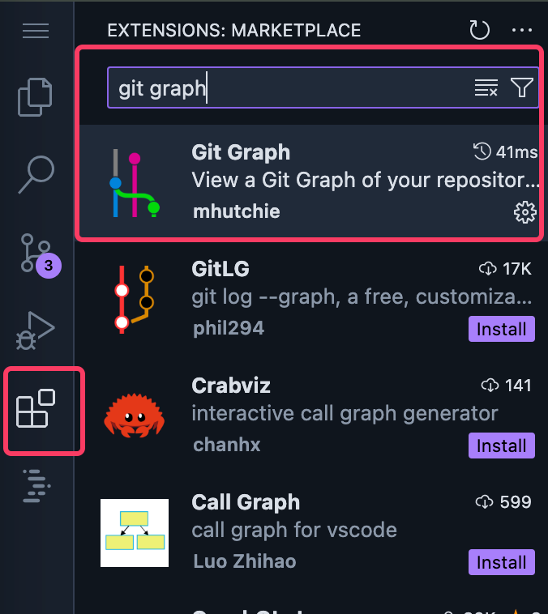
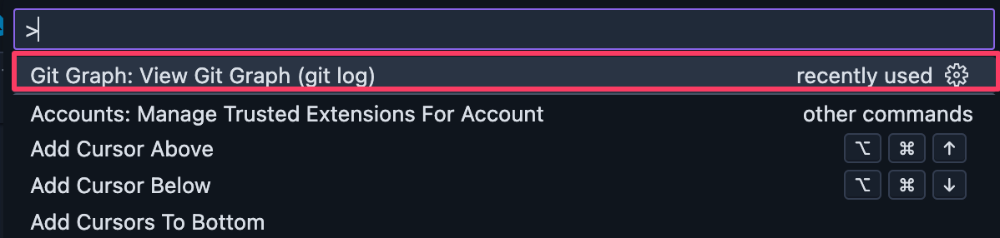
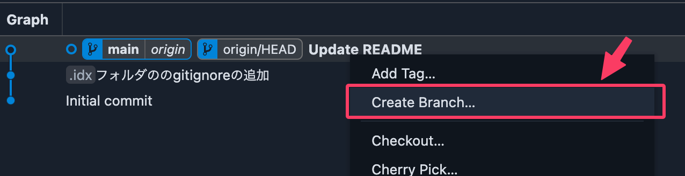
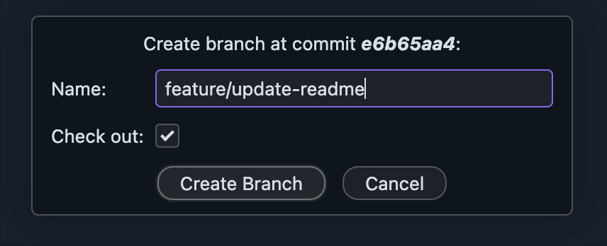
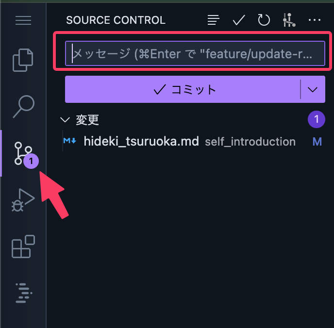
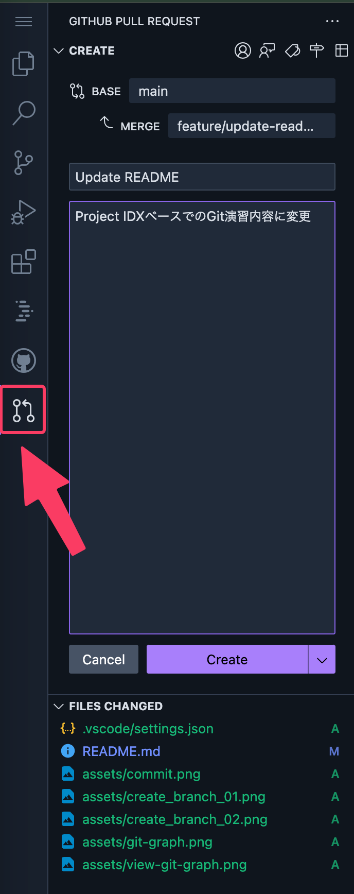
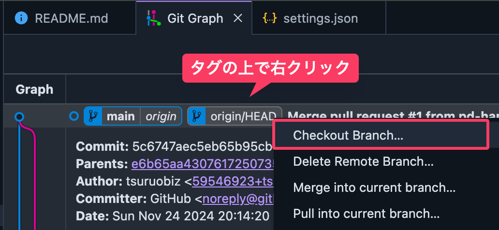

# git-training

Flutter研修のGit演習用レポジトリです。

## 使用するExtension
- [Git Graph - Visual Studio Marketplace](https://marketplace.visualstudio.com/items?itemName=mhutchie.git-graph)
- [GitHub Pull Requests - Visual Studio Marketplace](https://marketplace.visualstudio.com/items?itemName=GitHub.vscode-pull-request-github)

## Gitのコマンド確認

以下のコマンドでバージョンが返ってこない場合はgitがインストールされていないため、インストールを再度お試しください。

```sh
git --version

# git version 2.44.2
```

（任意）usernameなどを変更したい場合は以下で変更可能です。

```sh
git config --global user.name [username]
```

設定された値は以下で確認できます。

```sh
❯ git config -l | grep user
user.email=[YOUR_EMAIL]
user.name=[YOUR_USERNAME]
```

## 演習: プルリクエストを作成してコミットする

### 1. Git GraphのExtensionをインストールする


参考: [Git Graph - Visual Studio Marketplace](https://marketplace.visualstudio.com/items?itemName=mhutchie.git-graph)


### 2. ブランチの作成

コマンドパレット（`Cmd+Shift+P`）を開き、検索窓に`git graph`などを入力して「View Git Graph」を選択します。


| Step.01 | Step.02 |
| --- | --- |
|  |  |

ブランチが切り替わったかを確認します。作成したブランチに`*`マーク（環境次第）が付いていればOKです。


### 3. コミットする

1. `self_introduction`フォルダ配下に、`[自分の名前]_[自分の名字].md`のファイルを作成し自己紹介を[Markdown記法](https://ja.wikipedia.org/wiki/Markdown)を使って書いてみましょう。[hideki_tsuruoka.md](self_introduction/hideki_tsuruoka.md)を参考にしてください。
    - 参考: [Markdown記法一覧](https://qiita.com/oreo/items/82183bfbaac69971917f)

1. 記入が終わったらコミットします。左側のアクティビティパネルからブランチアイコンをクリックしコミットメッセージを入れてコミットします。



## プルリクエストを作成する

先程の作業内容をレビュワーに「受け入れて下さい」というリクエストを出します。
方法は大きく2つありますが、どちらでも好きな方法で試してください。

### 「GitHub Pull Requests」でIDXから作成する方法
1. 
1. 




### Webのコンソール（github.com）から作成する方法
1. GitHubのWebコンソール（GUI）で操作します。
1. レビュワーがわかるようにコメントを書きましょう。
1. レビュワーは作業内容に問題が無いことを確認したらマージします。
1. マージが完了したら各人の作業内容がmainブランチに統合されます。

## マージを確認する

`main`ブランチに切り替えて、みなさんの変更内容を確認しましょう。



これで、`self_introduction`のファイルを見ると各人のプロフィールファイルを確認できるようになりました。
